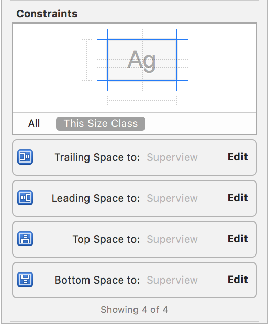

# Troubleshooting

If you are having trouble using Tabman, please check out this document to see if you can resolve any problems that you're having. If not please raise an [issue](https://github.com/uias/Tabman/issues/new).

## Contents
- [Automatic Insetting](#automatic-insetting)

## Automatic Insetting
Tabman is designed to automatically inset the contents of child view controllers that contain `UIScrollView` and other derived classes so that it shows correctly beneath the bar:

<p align="center">
    </br>
    
    </br>
</p>

If you are having issues with Automatic Insetting, please try the following steps...

### 0) Make sure you're up to date
Ensure you're using the latest releases of both [**Tabman**](https://github.com/uias/Tabman/releases/latest) and [**AutoInsetter**](https://github.com/uias/AutoInsetter/releases/latest).

### 1) Ensure it's turned on
Make sure that auto insetting is enabled (it is by default).
```swift
.automaticallyAdjustsChildInsets = true
```

### 2) Check your constraints
If you are using a custom view controller (and not something like a `UITableViewController`), the way that your content scroll view is constrained to the superview is very important.

It is recommended that your `UIScrollView` is constrained directly to the superview, as shown below:

<p align="center">
    
</p>

As you can see, the constraints for the `UITableView` are pinned to the superview rather than the `topLayoutGuide` or `Safe Area`.

<p align="center">
    
</p>

### 3) Watch out for UIKit
Tabman will also handle any `UIKit` properties that require modifying in order to get a reliable insetting behaviour. As we're providing a completely custom implementation, we disable a lot of the `UIKit` helper properties that would otherwise inset content correctly for system components such as a `UITabBar`.

Therefore, you shouldn't need to modify or have any of the following in your view controller code:
```swift
UIScrollView.contentInsetAdjustmentBehavior
UIViewController.automaticallyAdjustsScrollViewInsets
```

Modifying these properties will more than likely cause issues with the auto insetting engine, so it is advised to remove any usages from your code.

### 4) Everything *should* be okay
By this point, you should have a beautifully insetted table view in your child view controller, otherwise 😭.

**Next steps:**
1. It might be useful to use the numbers provided by `bar.requiredInsets` to manually inset your content. Depending on how successful this is will help with debugging.
2. Raise an [issue](https://github.com/uias/Tabman/issues/new), and provide as much detail as you can about your layout and just what is going wrong.
3. We'll get on with fixing it as soon as possible 🤞.
