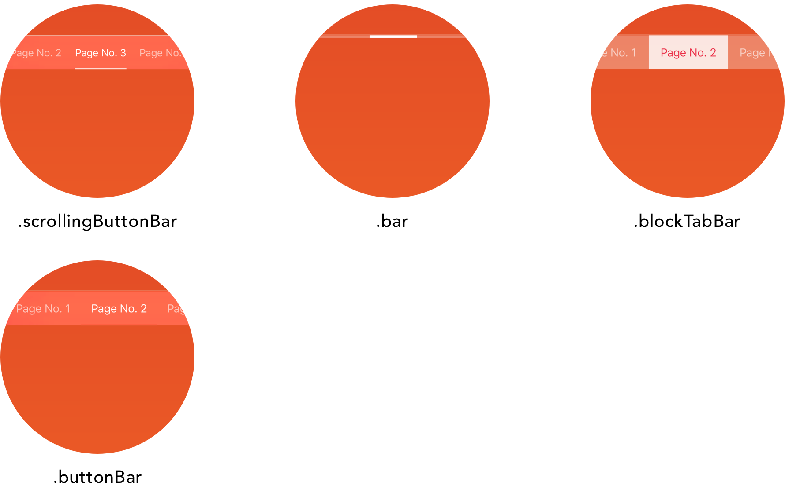

<p align="center">
    
</p>
[](https://travis-ci.org/MerrickSapsford/Tabman)
[]()
[](https://codecov.io/gh/MerrickSapsford/Tabman)

**Tabman** is a powerful paging view controller with indicator bar component, for iOS.

## Features
- [x] Super easy to implement page view controller with indicator bar.
- [x] Multiple indicator bar styles.
- [x] Simplistic and powerful customisation.
- [x] Built on a powerful and informative page view controller, [Pageboy](github.com//msaps/pageboy).

## Installation
### CocoaPods
Tabman is available through [CocoaPods](http://cocoapods.org). To install it, simply add the following line to your Podfile:
```ruby
pod 'Tabman'
```
And run `pod install`.

**Dependencies**

- [Pageboy](http://github.com/msaps/Pageboy) by Merrick Sapsford
- [PureLayout](https://github.com/PureLayout/PureLayout) by PureLayout

### Example
A nice pretty example project is available to take a look at some of the features that `Tabman` offers. When checking out the repo, ensure you include submodules. Simply build and run the project in Xcode. 

## Usage
### Getting Started

1) Create an instance of `TabmanViewController` and provide it with a `PageboyViewControllerDataSource`. Note: `TabmanViewController` conforms to and is set as the `PageboyViewControllerDelegate`.

```swift
class YourTabViewController: TabmanViewController, PageboyViewControllerDataSource {
	
	override func viewDidLoad() {
		super.viewDidLoad()
		
		self.dataSource = self
	}
}
```

2) Implement the `PageboyViewControllerDataSource` and configure the bar for display.

```swift
func viewControllers(forPageboyViewController pageboyViewController: PageboyViewController) -> [UIViewController]? {
    // return array of view controllers
    let viewControllers = [viewController1, viewController2]
    
    // configure the bar
    self.bar.items = [TabmanBarItem(title: "Page 1"), 
					  TabmanBarItem(title: "Page 2")]
    
    return viewControllers
}

func defaultPageIndex(forPageboyViewController pageboyViewController: PageboyViewController) -> PageboyViewController.PageIndex? {
    // use default index
    return nil
}
```

3) All done! 🍻

### Doing a bit more
As `Tabman` is based on [Pageboy](github.com/msaps/Pageboy), everything behaves the same and all the same properties/functions are available. Such as these functions for navigation & reloading:

```swift
// Scroll the page view controller to a new page.
public func scrollToPage(_ pageIndex: PageIndex,
                         animated: Bool,
                         completion: PageTransitionCompletion? = nil)

// Reload the view controllers in the page view controller.                         
public func reloadPages()
```

Read up on the `Pageboy` docs to find out a bit more [here](https://github.com/msaps/Pageboy/blob/master/README.md).

## Customisation
The `TabmanBar` in Tabman can be completely customised to your liking, by simply modifying the available properties in the `.bar` `TabmanBarConfig` object.

#### Style
The style of bar to display, by default this is set to `.buttonBar`.  

**Available Styles:**
<p align="center">
    
</p>

**Upcoming Styles:**

- `.segmentedBar` - UISegmentedControl style bar.
- `.blockButtonBar` - Non-scrolling Button bar with solid indicator.
- `.tabBar` - UITabBar style bar.

#### Location
Where you want the bar to appear, either at the top or bottom of the screen. By default this is set to `.preferred` which will use the predefined preferred location for the active style.

The bar will automatically take `UIKit` components such as `UINavigationBar` and `UITabBar` into account.

#### Appearance
The `TabmanBarAppearance` object provides all the available properties for appearance customisation of a `TabmanBar`. Not all of the properties are appropriate for each style `TabmanBar`, therefore the bar will only respond to the properties it adheres to.

To set a custom appearance definition do this on a `TabmanViewController`:

```swift
tabViewController.bar.appearance = TabmanBar.AppearanceConfig({ (appearance) in
	// customise appearance here
	appearance.text.color = UIColor.red
	appearance.indicator.isProgressive = true
}) 
```

The following properties are available:

```swift
/// Indicator configuration
public struct Indicator {
	/// The color of the bar indicator.
	public var color: UIColor?
	/// The weight (thickness) of the bar indicator.
	public var weight: TabmanLineIndicator.Weight?
	/// Whether the indicator transiton is progressive.
	public var isProgressive: Bool?
}
        
/// Text configuration
public struct Text {
	/// The font to use for text labels in the bar.
	public var font: UIFont?
	/// The text color to use for selected tabs in the bar.
	public var selectedColor: UIColor?
	/// The text color to use for tabs in the bar.
	public var color: UIColor?
}
        
/// Layout configuration
public struct Layout {
	/// The spacing between items in the bar.
	public var interItemSpacing: CGFloat?
	/// The spacing at the edge of the items in the bar.
	public var edgeInset: CGFloat?
}

/// The background style for the bar.
public var backgroundStyle: TabmanBarBackgroundView.BackgroundStyle?
        
/// Whether to show a fade on the items at the bounds edge of the bar.
public var showEdgeFade: Bool?
        
/// Whether scroll is enabled on the scroll view in the bar.
public var isScrollEnabled: Bool?


```

`TabmanBar` itself is available as a sub-component of `Tabman` - more advanced documentation is available [here]().

## Getting In Touch
Please feel free to contact me on [Twitter](https://twitter.com/MerrickSapsford).

## Contributing
Bug reports and pull requests are welcome on GitHub at [https://github.com/MerrickSapsford/Tabman](https://github.com/MerrickSapsford/Tabman).

## License

The library is available as open source under the terms of the [MIT License](http://opensource.org/licenses/MIT).
