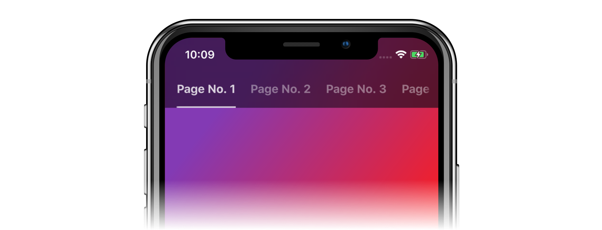

<p align="center">
    
</p>

<p align="center">
    <a href="https://travis-ci.org/uias/Tabman">
        
    </a>
    
    <a href="https://cocoapods.org/pods/Tabman">
        
    </a>
	<a href="https://cocoapods.org/pods/Tabman">
        
    </a>
	<a href="https://github.com/Carthage/Carthage">
        
    </a>
	<a href="https://codecov.io/gh/uias/Tabman">
        
    </a>
	<a href="https://github.com/uias/Tabman/releases">
        
    </a>
</p>

<p align="center">
    
</p>
 
## ⭐️ Features
TODO

## 📋 Requirements
Tabman requires iOS 9; and is written in Swift 4.2.

## 📲 Installation
### CocoaPods
Tabman is available through [CocoaPods](http://cocoapods.org):
```ruby
pod 'Tabman', '~> 2.0'
```

### Carthage
Tabman is also available through [Carthage](https://github.com/Carthage/Carthage):
```ogdl
github "uias/Tabman" ~> 2.0
```

## 🚀 Usage

## ⚠️ Troubleshooting
If you are encountering issues with Tabman, please check out the [Troubleshooting Guide](Docs/TROUBLESHOOTING.md).

If you're still having problems, feel free to raise an [issue](https://github.com/uias/Tabman/issues/new).

## 👨🏻‍💻 About
- Created by [Merrick Sapsford](https://github.com/msaps) ([@MerrickSapsford](https://twitter.com/MerrickSapsford))
- Contributed to by a growing [list of others](https://github.com/uias/Tabman/graphs/contributors).


## ❤️ Contributing
Bug reports and pull requests are welcome on GitHub at [https://github.com/uias/Tabman](https://github.com/uias/Tabman).

## 👮🏻‍♂️ License
The library is available as open source under the terms of the [MIT License](http://opensource.org/licenses/MIT).
