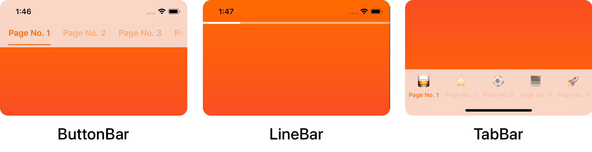
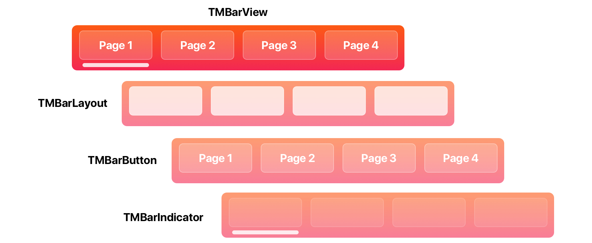

<p align="center">
    <a href="https://github.com/uias/Tabman">
        
    </a>
    
	<a href="https://github.com/uias/Tabman/releases">
        
    </a>
    <a href="https://swift.org/package-manager/">
        
    </a>
</p>


## ⭐️ Features
- Easy to implement page view controller with interactive indicator bars.
- Highly adaptable and powerful customization.
- Fully extensible with mix-and-match component library.
- Built on [Pageboy](https://github.com/uias/Pageboy), a simple, informative page view controller.
- Automatically insets child view controller contents.

## 📋 Requirements
Tabman requires iOS 9 or above; and is compatibile with Swift 5.

## 📲 Installation

### Swift Package Manager
Tabman is compatible with [Swift Package Manager](https://swift.org/package-manager) and can be integrated via Xcode.

### CocoaPods
Tabman is also available through [CocoaPods](http://cocoapods.org):

```ruby
pod 'Tabman', '~> 2.9'
```

### Carthage
Tabman is also available through [Carthage](https://github.com/Carthage/Carthage):

```ogdl
github "uias/Tabman" ~> 2.9
```

## 🚀 Usage

### The Basics
1) Set up your view controller with the an array of view controllers that you want to appear.
2) Set the `PageboyViewControllerDataSource` data source of the `TabmanViewController`.
3) Create, customize and add as many `TMBar`s as you want.

```swift
import Tabman
import Pageboy

class TabViewController: TabmanViewController {

    private var viewControllers = [UIViewController(), UIViewController()]

    override func viewDidLoad() {
        super.viewDidLoad()

        self.dataSource = self

        // Create bar
        let bar = TMBar.ButtonBar()
        bar.layout.transitionStyle = .snap // Customize

        // Add to view
        addBar(bar, dataSource: self, at: .top)
    }
}
```

**When adding a bar, you can choose to add it to the predefined areas (`.top`, `.bottom`, `.navigationItem(item:)`) or to a custom view with `.custom(view:layout:)`. For more information, read the [Adding a Bar](https://uias.github.io/Tabman/main/adding-a-bar.html) guide.**

4) Configure your data sources.

```swift
extension TabViewController: PageboyViewControllerDataSource, TMBarDataSource {

    func numberOfViewControllers(in pageboyViewController: PageboyViewController) -> Int {
        return viewControllers.count
    }

    func viewController(for pageboyViewController: PageboyViewController,
                        at index: PageboyViewController.PageIndex) -> UIViewController? {
        return viewControllers[index]
    }

    func defaultPage(for pageboyViewController: PageboyViewController) -> PageboyViewController.Page? {
        return nil
    }

    func barItem(for bar: TMBar, at index: Int) -> TMBarItemable {
        let title = "Page \(index)"
        return TMBarItem(title: title)
    }
}
```

### Bar Items
A bar will ask for a `TMBarItemable` for each page that is provided to the `TabmanViewController` `dataSource`. `TMBarItemable` is a  protocol that can be used for custom item types, the default in Tabman being `TMBarItem`:

```swift
let item = TMBarItem()
item.title = "Item 1"
item.image = UIImage(named: "item.png")
item.badgeValue = "New"
```

#### UIKit Itemables

Tabman also provides support for some native `UIKit` types as `TMBarItemable`:
- `UINavigationItem`
- `UITabBarItem`

*These types are unfortunately unable to support the dynamic updating of the bar when setting properties.*

### Choosing a look
Tabman provides numerous, easy to use template styles out of the box:



These are all available as types of `TMBar` in [TMBar+Templates](https://github.com/uias/Tabman/blob/main/Sources/Tabman/Bar/TMBar%2BTemplates.swift).

```swift
let bar = TMBar.ButtonBar()
let tabBar = TMBar.TabBar()
```

### Customization
Bar customization is available via properties on each functional area of the bar. Each bar is made up of 4 distinct areas:




#### TMBarView
`TMBarView` is the root view of every bar, and provides the glue for meshing all the other functional areas together. You can change a few things here, such as background style and transitioning behavior.

```swift
bar.background.style = .blur(style: .extraLight)
bar.transitionStyle = .snap
```
*This is also the entry point for all other customization.*

##### 🧲 Properties of  Interest
- `backgroundView` - `TMBarBackgroundView` which provides background styling.
- `scrollMode` - What type of interactive scrolling to allow.
- `fadesContentEdges` - Whether to fade the edges of the bar contents as it goes off-screen.

**More: [**TMBarView Docs**](https://uias.github.io/Tabman/main/Bar.html)**

#### TMBarLayout
`TMBarLayout` is the foundation of a `TMBarView`, dictating how bar buttons are displayed and laid out. Look here if you want to change things such as button spacing, content insets and other layout'y things.

```swift
bar.layout.contentInset = UIEdgeInsets(top: 0.0, left: 20.0, bottom: 0.0, right: 20.0)
```

##### 🧲 Properties of  Interest
- `contentMode` - How the layout should display its contents; either restricted to the bar width with `.fit` or intrinsically sized with `.intrinsic`.
- `contentInset` - Inset to be applied to the edges of the layout.
- `transitionStyle` - How the layout should perform transition animations.
- `alignment` - How the layout should be aligned in the bar.

**More: [**TMBarLayout Docs**](https://uias.github.io/Tabman/main/Layout.html)**

#### TMBarButton
`TMBarButton` views are populated in the `TMBarLayout` and correspond to the items provided by the data source. This is the place to change things like fonts, image sizing and highlight colors.

As you will most likely dealing with more than one button, you can modify the whole set at once:

```swift
bar.buttons.customize { (button) in
	button.tintColor = .orange
	button.selectedTintColor = .red
}
```

*This will be applied to both existing bar buttons and any that are added to the bar afterwards.*

##### 🧲 Properties of  Interest
- `backgroundView` - `TMBarBackgroundView` which provides background styling.
- `contentInset` - Inset to be applied to the edges of the button.
- `transitionStyle` (`TMBarButtonCollection`) - How the buttons should should perform transition animations.
- `badge` - `TMBadgeView` that displays `badgeValue` from bar item.

**More: [**TMBarButton Docs**](https://uias.github.io/Tabman/main/Buttons.html)**

#### TMBarIndicator
Lastly is `TMBarIndicator` - which indicates the current page index status for the bar. You can change behavior characteristics here as well as how the indicator looks.

```swift
bar.indicator.overscrollBehavior = .compress
bar.indicator.weight = .heavy
```

##### 🧲 Properties of  Interest
- `overscrollBehavior` - How the indicator should handle scrolling beyond the bounds of the bar items.
- `isProgressive` - Whether the indicator should act progressively when transitioning through page indexes.
- `transitionStyle` - How the indicator should should perform transition animations.

**More: [**TMBarIndicator Docs**](https://uias.github.io/Tabman/main/Indicator.html)**

## 🎨 Advanced Customization
Tabman provides the complete freedom to mix-and-match the built-in components; and also define your own.

`TMBarView` leverages generics to define and serve the three distinct functional areas of the bar. This means...

```swift
// ...that the preset...
let bar = Bar.ButtonBar()

// ...is actually under the hood:
let bar = BarView<HorizontalBarLayout, LabelBarButton, LineBarIndicator>
```
So swapping in another type of layout, button or indicator could not be simpler.

Lets say you wanted to actually use a `DotBarIndicator` rather than the `LineBarIndicator`:

```swift
let bar = BarView<HorizontalBarLayout, LabelBarButton, DotBarIndicator>
```

**The following components are available in Tabman:**

#### Bar Layouts
- `TMHorizontalBarLayout` - Layout that displays bar buttons sequentially along the horizontal axis.
- `TMConstrainedHorizontalBarLayout` - Layout that displays bar buttons sequentially along the horizontal axis, but is constrained by the number of items it can display.

#### Bar Buttons
- `TMLabelBarButton` - Button which contains a single text label.
- `TMTabItemBarButton` - Button which mimics appearance of a `UITabBarItem`, containing a image and label vertically aligned.
- `TMBarButton.None` - Display no visible bar buttons.

#### Bar Indicators
- `TMLineBarIndicator` - Simple indicator that displays as a horizontal line.
- `TMChevronBarIndicator` - Indicator that displays a vertical chevron centered along the X-axis.
- `TMBlockBarIndicator` - Indicator that fills the bar, displaying a solid color.
- `TMDotBarIndicator` - Indicator that displays a circular dot centered along the X-axis.
- `TMBarIndicator.None` - Display no visible indicator.

### Going Completely Custom
As replacing the type of layout, button or indicator is as easy as above; you have the ability to define your own subclasses without too much of a headache.

[**Custom Tabman Components**](https://uias.github.io/Tabman/main/going-custom.html)

There are also example projects that showcase custom layouts and such:

- [**Tinderbar**](https://github.com/uias/Tinderbar) - Tinder iOS app layout built with Tabman.

## 📐 Content Insetting
Tabman automatically adjusts any content in its child view controllers so that it displays correctly beneath any visible bars. It provides the following behaviors:

- Updates `contentInset` and `contentOffset` appropriately for any `UIScrollView` or derived subclass found in the child view controller's subviews.
- Sets `additionalSafeAreaInsets` to reflect the required safe areas including the bar contents. Any views constrained to the safe area in the child view controller will be laid out correctly (**Only available in iOS 11 and above.**)

`TabmanViewController` also provides `barLayoutGuide`, a `UILayoutGuide` that provides top and bottom anchors taking into account any bars added to the `.top` or `.bottom` `TabmanViewController.BarLocation` areas. The raw `UIEdgeInsets` are also available via `.barInsets`.

Auto insetting can be **disabled** by setting `automaticallyAdjustsChildInsets` to `false` - however this **must be done before `viewDidLoad`**.

*Tabman will not provide any insetting behavior for bars that are added to custom views.*

## ⚠️ Troubleshooting
If you are encountering issues with Tabman, please check out the [Troubleshooting Guide](https://uias.github.io/Tabman/main/troubleshooting.html).

If you're still having problems, feel free to raise an [issue](https://github.com/uias/Tabman/issues/new).

## 👨🏻‍💻 About
- Created by [Merrick Sapsford](https://github.com/msaps) ([@MerrickSapsford](https://twitter.com/MerrickSapsford))
- Contributed to by a growing [list of others](https://github.com/uias/Tabman/graphs/contributors).

## ❤️ Contributing
Bug reports and pull requests are welcome on GitHub at [https://github.com/uias/Tabman](https://github.com/uias/Tabman).

## 👮🏻‍♂️ License
The library is available as open source under the terms of the [MIT License](http://opensource.org/licenses/MIT).
